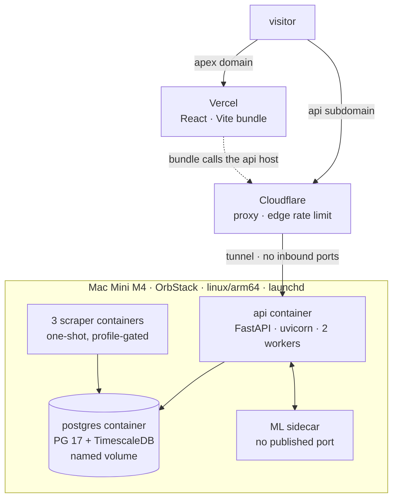
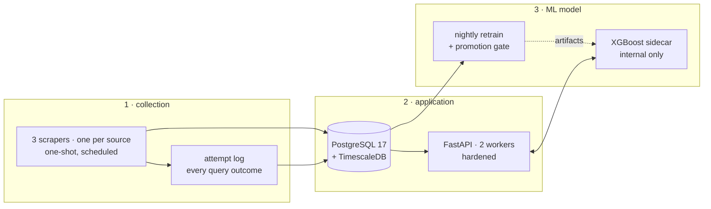
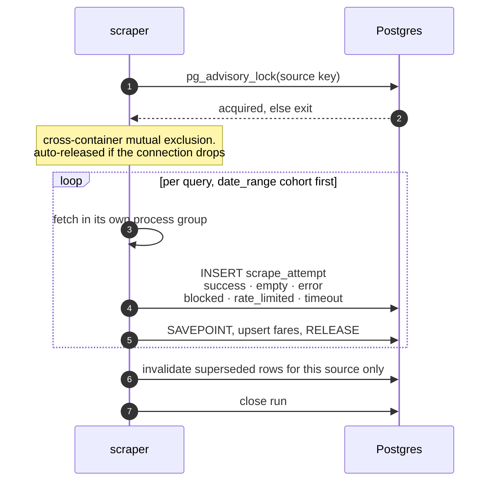
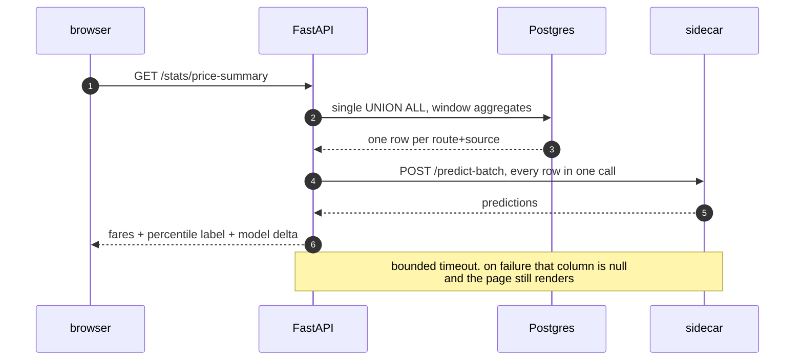
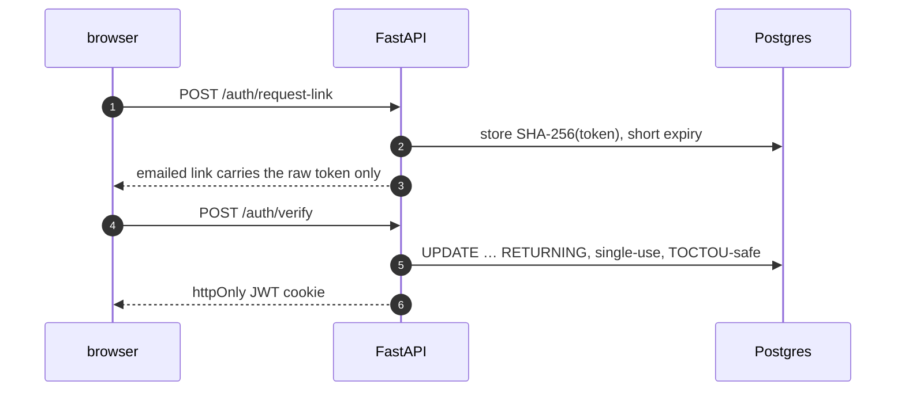
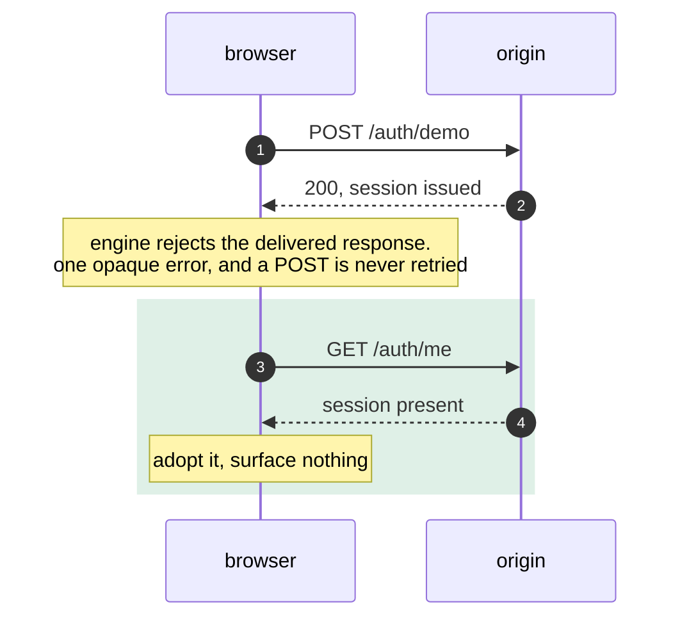
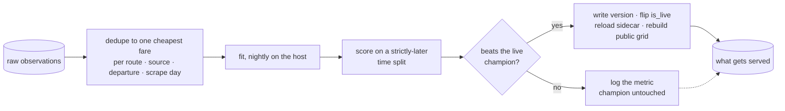
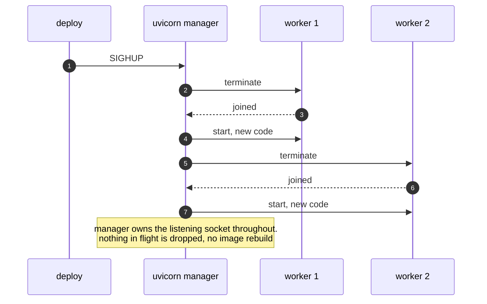
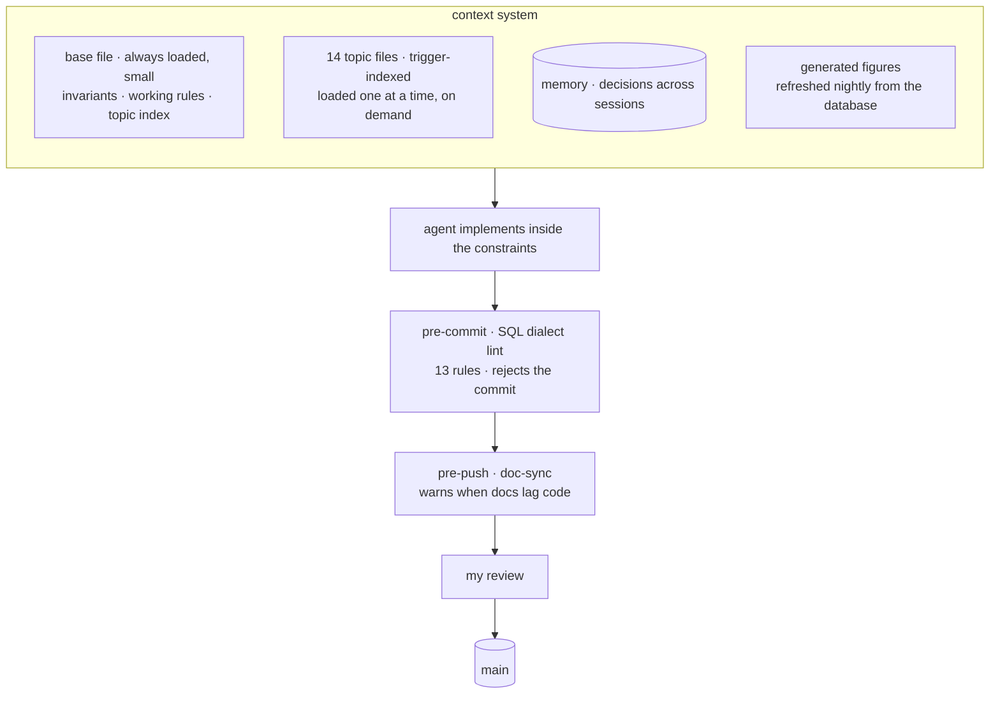

  <picture>
    <source media="(prefers-color-scheme: dark)" srcset="docs/logo-dark.png" />
    
  </picture>

  Three subsystems on one machine: collection, an application to operate it, and a gated AI model that has to earn its way into serving.

  
  
  
  
  
  
  
  
  
  
  
  

## 📊 Overview

| Subsystem | Owns | Public surface |
|---|---|---|
| **1 · Collection** | Three sources, four times a day, every outcome recorded | None, internal |
| **2 · Application** | API, dashboard, route pages, alerts, ops console | [skaisearch.com/app](https://skaisearch.com/app), opens as a view-only guest |
| **3 · Model (ML)** | Nightly retrain, promotion gate, inference | [skaisearch.com](https://skaisearch.com), no login |

<!-- stats:start:strip · generated from the live database, do not hand-edit -->
**13.2M+** price observations · **1.44M+** flights · **1,120k+** logged query attempts ·
**1,900+** collection runs · **35** active routes · **27** airports · **6.0 GB** on disk ·
collecting since 2026-02-02.
<!-- stats:end:strip -->

<!-- stats:start:codebase · generated from the schema and the working tree, do not hand-edit -->
23 tables · 19 migrations · 114 named queries.
<!-- stats:end:codebase -->

## 🏗 Architecture

### Deployment view

| Non-functional requirement | Implementation |
|---|---|
| Apex domain | Vercel serves the built React bundle. The api container serves the same build, so the two cannot diverge |
| `api.` subdomain | Cloudflare proxy, then an outbound tunnel. No inbound port is open on the machine or the router |
| `db.` subdomain | Cloudflare proxy, restricted access |
| Adminer | Unrouted, loopback only, and absent from the default compose up |
| Container runtime | OrbStack rather than Docker Desktop, set to start at login and never pause its VM while the host sleeps |
| CPU architecture | Every service pins `linux/arm64`; base images are version-locked, not floating tags |
| State | Postgres in a named volume, not a bind mount, which avoids the file-locking failure mode |
| Profiles | Scrapers and Adminer are profile-gated, so `compose up` starts only the long-running services |
| Scheduling | `launchd` on the host, not cron inside a container |
| Host tuning | Persistent sysctl ephemeral-port and TIME_WAIT tuning via a LaunchDaemon, after a TCP port-exhaustion outage |

### Component view

| Service | Role | Isolation |
|---|---|---|
| `postgres` | TimescaleDB image, named volume | Loopback-bound, healthchecked, per-role `statement_timeout` |
| `api` | REST, and serves the built frontend | `cap_drop: ALL`, read-only rootfs + tmpfs, non-root uid, CPU/mem/PID caps |
| ML sidecar | Inference only | Internal network only, no published port, hardened identically |
| 3 scrapers | One per source, one-shot | `init: true` for reaping, own process group per fetch, `cap_drop: ALL` |
| `adminer` | DB browser | Compose profile, absent from default `up` |

Three least-privilege roles. API and scrapers hold CRUD without DDL, so a leaked credential cannot alter
schema or read server files.

---

# 📥 1 · Collection

| Mechanism | Failure it addresses |
|---|---|
| Postgres advisory lock | Per-container `/tmp` made file locks non-exclusive across containers |
| `SAVEPOINT` per row | One bad row aborts the whole transaction, rejecting every later statement |
| Subprocess per fetch, killed by process group | `asyncio.run` on a non-main thread never returns, leaking a thread and a browser per hang |
| `init: true` as PID 1 | Python does not reap reparented children. Zombies exhausted the PID ceiling and new processes could not fork |
| Cohort ordering | A truncated run drops the cheap refillable tail, never the harder cohort |
| Server-side `now()` for timestamps | A VM clock jump wrote rows into the future, corrupting ordering and invalidation |
| Two sampling modes in parallel | A rolling lead-time ladder answers seasonality; only a fixed departure window accumulates a booking trajectory |

**Every query writes an outcome, not only the ones that found fares.** That is what separates no-availability
from being blocked, and the distinction has teeth: one source once read as 40% empty, and 100% of those rows
had a successful result from a different source for the same route and date. Relabelled, and that class is
excluded from availability features.

---

# 🖥 2 · Application

| Endpoint | Before | After | Change |
|---|---|---|---|
| `/flights/latest` | 2,500 ms | **128 ms** | Bounded window first, then `DISTINCT ON`, replacing a tuple-IN over a `MAX()` subquery |
| `/flights/departure-dates` | 1,820 ms | **1.7 ms** | Aggregated a route's entire history on every page load. Rolled up to one row per departure date per scrape day, refreshed when the writers finish |
| `/stats/airlines-on-routes` | 187 ms | **9.5 ms** | `EXISTS` planned as a 301k-loop nested join, rewritten to JOIN + DISTINCT for a hash join |
| Any request | ~4 ms | **~0.3 ms** | `psycopg_pool` instead of a per-request handshake |

The departure-dates one is the shape worth naming, because the query was not badly written. It scanned 2.4
million observations to return 304 rows, and it got slower every night, so rewriting it was never going to
fix the trend. The whole history rolls up to 61,179 rows. Both cheaper-looking fixes were dead ends, and
measuring said so before I committed to either: a validity filter cut the chart from 304 departure dates to
36, because this table keeps its history in the rows a later scrape supersedes, and a covering index for an
index-only scan bought nothing, because the cost was the row count rather than the access path. Scrapers are
the only writers, so the rollup refreshes when a run finishes and is never stale by more than the gap
between runs.

Timing every endpoint to find the others turned up the opposite result too. The slowest one left, 4.1 s over
a 30 day window, had no caller anywhere, so it was deleted rather than optimised. Its window looked bounded
and its cost was not.

Pool-level `statement_timeout` an order of magnitude above the heaviest legitimate query, so no request can
pin a pool slot against the scrapers.

### Auth, and a delivered response the browser threw away

| Control | Implementation |
|---|---|
| Token at rest | SHA-256, so a database read cannot be replayed into a session |
| 401 responses | One neutral message on every path, so the reason cannot be probed |
| Client retries | Transient statuses and fetch rejections only, bounded attempts, safe methods by default; a deliberate 4xx is final |
| Guest writes | Rejected for every unsafe method at one chokepoint in the auth dependency, not per endpoint |
| Guest reads | Explicit no-PII allow-list; user, alert and log endpoints stay admin-only |
| Admin SQL console | SELECT allow-list, side-effecting read functions denied, per-query timeout |

### Frontend

| Non-functional requirement | Implementation |
|---|---|
| Bundles | Code-split, chart library lazy so it arrives only with a chart |
| Build | Under a second, from roughly four |
| i18n | Full English and Italian, disclaimers included |
| Accessibility | Landmarks, focus rings, described sliders, canvas with a text alternative, AA contrast |
| Alerts | Drop, threshold and rising. Per recipient, per route, converted to the recipient's currency, deduplicated per route and departure date. A separate watcher fires once all three sources report for a window |

---

# 🤖 3 · AI model (machine learning)

Deduplication before the split is load-bearing: roughly four re-quotes a day of the same itinerary would
otherwise straddle the train/test boundary.

| Signal | State | Metric |
|---|---|---|
| Percentile price label | Live | Stable per-route spread, tightens with history |
| Event-driven seasonality | Live | Origin-holiday lift beats naive out-of-sample on every route the gate promotes |
| Per-month seasonality index | Rejected by the gate | A monthly mean flattens the in-holiday spike |
| Per-route climate lift | Rejected, retried nightly | Falls back to holiday-only until the data carries it |
| Booking-curve forecaster | Built, gated off | In-sample win was per-route leakage. Naive wins the time split at every horizon |

<!-- stats:start:model · generated from the promoted model, do not hand-edit -->
The promoted model scores **R² 0.73** against a **0.13** median baseline at **20.5%** error, fitted on
130,745 rows across 400 trees. Gain by feature:

| Feature | Gain | Feature | Gain |
|---|---|---|---|
| Trip type | ██████████ 42.0% | Climate season | ▌ 2.6% |
| Distance / haul | █████▎ 22.2% | Source | ▎ 1.5% |
| Destination | ███▊ 15.8% | Lead time (days) | ▎ 1.1% |
| Stops | █▎ 5.3% | Carriers | ▏ 0.9% |
| Departure month | █ 4.5% | Weekend | ▏ 0.4% |
| Origin | ▉ 3.7% |  |  |
<!-- stats:end:model -->

One feature module is imported by both trainer and sidecar, so no second implementation can drift. Published
hyperparameters are read from the training source, because a serialised model reports library defaults for
training-time settings. Every figure on the public model page comes from one generated metadata block, so
none of it depends on being manually updated.

---

# 🚀 CI/CD and deployment

Four deploy targets, four mechanisms, because they have different constraints.

| Target | Trigger | Mechanism |
|---|---|---|
| **api** (backend, and the frontend build it serves) | Manual | Rolling `SIGHUP` for the Python code. Source and build are mounted read-only, so no image rebuild, and a rebuilt frontend needs no signal at all: it is read from disk per request |
| **frontend** (public apex) | Push to `main` | Vercel builds and deploys on its own |
| **scrapers** | Code change | Image rebuild. The next scheduled run picks it up, since these bake code in |
| **model** | Nightly promotion | Artifacts written to a shared volume, then the sidecar restarts to reload them |

| Property | Detail |
|---|---|
| Ships without an image rebuild | Frontend build and Python source mounted read-only |
| Previous behaviour | Container recreation dropped everything in flight: 14 deploys in 20 days, typically 11 s, once 8 m 09 s |
| Why it stayed invisible | The process that would have logged those errors was the one restarting |
| Consequence handled | Running more than one worker changed how request limits are accounted for, so they were retuned to hold the same effective envelope rather than left to drift |
| Still rebuilds | Scraper images bake code in |

### Scheduled work

| Job | Cadence | Runs |
|---|---|---|
| Keep the stack up | At login, then every 2 min | Starts any long-running service that is not running, and leaves healthy ones untouched |
| Collection | 4× daily, per source | One-shot container per source |
| Nightly | 03:00 | Retrain and gate, recompute distributions, invalidate stale observations, refresh feature data, regenerate published figures, `pg_dump` |
| Alert watcher | Every 10 min | Fires once all three sources report for a schedule window, with a timeout so a stalled source cannot block alerts |

### Resilience and disaster recovery

Backups are nightly `pg_dump -Fc` with retention, and the restore script is tested rather than assumed: it
snapshots first, then recreates the roles the dump deliberately omits.

Healthchecks assert what a container serves, not only what it depends on: the api's probes a live `SELECT 1`
and a non-5xx `/`, because a read-only bind mount resolves at container start and a stale one fails the
frontend while the database probe stays green. A 404 there is tolerated, since a container with no frontend
built yet is not a broken one.

---

# 🔒 Security

| Layer | Implementation |
|---|---|
| Database roles | Least-privilege. API and scrapers cannot change schema, so a leaked credential cannot drop a table or read server files |
| Secrets | File-mounted, absent from `docker inspect` |
| Containers | All capabilities dropped, no escalation, non-root, read-only rootfs on the API, resource ceilings |
| Tokens | Sign-in tokens stored hashed, so a database read cannot be replayed into a session |
| Guest role | Writes rejected for every unsafe method at one chokepoint, not per endpoint; PII endpoints unreachable |
| Admin SQL console | SELECT allow-list, side-effecting read functions denied, per-query timeout |
| Headers | CSP with no third-party origins, HSTS preload, frame-deny, nosniff, strict referrer |
| Ingress | Tunnel only, no inbound ports. Postgres and logs never leave the machine |

---

# 🧠 AI in my workflow

Two agent surfaces read the same files, one auto-loading the base file, the other over a filesystem MCP
scoped to the project directory. Those files also render in-app, so the repo and the product cannot diverge.

The context system is retrieval, not one long prompt. Topic files are trigger-indexed and pulled in one at a
time, so the LLM gets the document the task needs instead of the whole repository. It is the same RAG shape
as the Confluence retrieval surface I built at work, sized for a single codebase.

What follows is AI governance for agentic work: what an agent may never change, what the repository checks
without me, and the calls I keep.

### Invariants

| Invariant | Failure behind it |
|---|---|
| Re-query every count, never quote one from memory | Documented figures drift, and a confident stale number is worse than none |
| Do not regress the scraper isolation primitives | Process-group kills, PID-1 reaping, the advisory lock. Removing any one caused an outage |
| Roll the deploy, never recreate the container | The recreate path dropped every in-flight request, silently |
| Root cause over special case, and measure before naming | The crash that read as memory pressure |

### Guards

| Guard | Catches | When |
|---|---|---|
| SQL dialect lint, 13 rules | `julianday`, `ifnull`, `INSERT OR`, `AUTOINCREMENT`, `strftime`, `datetime('now')`, `HAVING` on alias, unescaped `LIKE %`, `CROSS JOIN … ON`, two `COALESCE` cases, integer against BOOLEAN | Pre-commit, blocking |
| Doc-sync | Docs lagging the code | Pre-push |
| Generated figures | Published counts diverging from the database | Nightly |
| Promotion gate | A model scoring better without generalising | Nightly |

A boolean migration once covered the named query files and missed the inline scraper SQL, dropping writes in
production. A review pass had already approved it.

### Division of labour

| Ownership | Scope |
|---|---|
| **Mine** | Architecture, schema, reverse-engineering the sources, diagnosis when production misbehaves |
| **Delegated** | Implementation inside the constraints, cross-file refactors, doc drafts, analysis scripts |
| **Never delegated** | Whether a signal generalises well enough to serve |

---

# 🧰 Stack

| Layer | Components |
|---|---|
| Runtime | Docker Compose · OrbStack · launchd · linux/arm64 |
| Collect | Python 3.13 · Playwright · HTTP clients · rotating residential proxies |
| Store | PostgreSQL 17 · TimescaleDB · psycopg pool · aiosql · pg_dump |
| Serve | FastAPI · uvicorn · React · Vite · TypeScript · MUI · JWT · Cloudflare Tunnel · Vercel |
| AI / ML | XGBoost · pandas · scikit-learn · SHAP |

Source and data are private. <a href="https://klauslila.com">Klaus Lila</a> ·
<a href="https://github.com/klauslila/klauslila-showcase">klauslila.com write-up</a>

© 2024-2026 Klaus Lila. All rights reserved. Not licensed for reuse.
